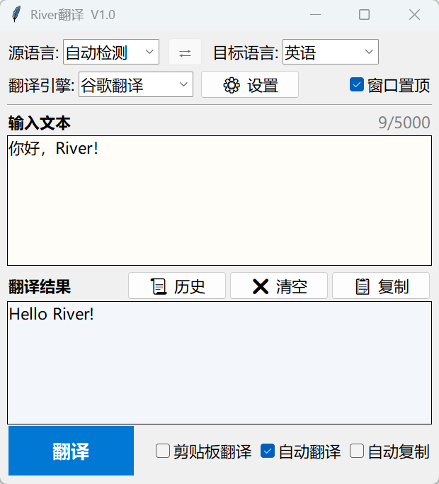
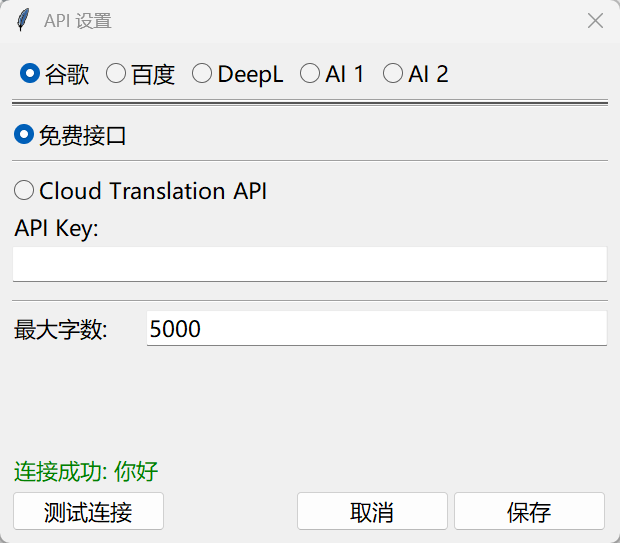

<p align="center">
  
  
  
  
</p>

<h1 align="center">River Translate</h1>

一个轻量、简约、免费的 Windows 纯文本翻译工具。仅依赖 Python 标准库，无需安装第三方包。适合日常查词、短句翻译、剪贴板翻译和多引擎对照。

## 界面

<p align="center">
  
  &nbsp;&nbsp;
  
</p>

## 功能

- 翻译引擎：谷歌、百度、DeepL、自定义 AI
- 谷歌免费接口开箱即用
- 自动检测源语言
- 翻译历史记录保存，并自动去重

可配置功能：

- **自动翻译** — 输入停止约 1 秒后自动翻译
- **剪贴板翻译** — 复制文本后自动填入并翻译
- **自动复制** — 翻译完成后自动复制译文
- **窗口置顶** — 窗口保持在其他窗口上方

## 快速开始

需要 Python 3.8+。

```bash
# 方式一：双击运行
run.bat

# 方式二：命令行
python src/main.py
```

## 翻译引擎

| 引擎 | 接口类型 | 需要配置 |
| --- | --- | --- |
| 谷歌翻译 | 免费接口（默认）/ Cloud API | 免费接口不需要；Cloud 模式需要 API Key（[申请](https://cloud.google.com/translate)） |
| 百度翻译 | 通用翻译 API | AppID + SecretKey（[申请](https://fanyi-api.baidu.com/)） |
| DeepL | Free API / Pro API | API Key（[申请](https://www.deepl.com/pro-api)） |
| 自定义 AI 1 / 2 | OpenAI 兼容接口 | Base URL、模型名；API Key 视服务要求填写 |

**谷歌翻译** — 免费接口无需配置即可使用，但受网络环境影响，国内可能无法访问。Cloud 模式为 Google 官方付费翻译 API，需申请 API Key，稳定性好。

**百度翻译** — 免费申请，国内用户可直接使用，稳定性好。

**DeepL** — 翻译质量高，但国内用户获取 API Key 较困难。

**自定义 AI** — 支持兼容 OpenAI 接口的服务，例如 DeepSeek、MiMo、本地兼容服务等。Base URL 和模型名必填；API Key 按服务要求填写，本地无鉴权服务可留空。翻译质量由所选 AI 平台决定，可在设置中填写"领域/风格"来获取不同风格的翻译内容。

## 使用

启动后选择源语言、目标语言和翻译引擎，输入文本后按 `Enter` 或点击翻译按钮。

| 快捷键 | 功能 |
| --- | --- |
| `Enter` | 翻译 |
| `Ctrl + Enter` / `Shift + Enter` | 换行 |
| `Escape` | 空闲时清空输入和输出 |
| `Escape` | 翻译中终止翻译 |

语言栏中间的 ⇄ 按钮可交换源语言和目标语言，同时交换输入框和输出框的内容。

支持语言：自动检测源语言；目标语言支持自动中英、中文、英语、日语、韩语、法语、德语、俄语、西班牙语。目标语言为自动中英时，程序根据输入文本的第一个有效字符在中文/英语目标语言之间自动选择。

## 高级配置

以下通用配置可在设置界面调整，也可通过手动编辑 `user_data/config.json` 修改。**手动修改前请关闭应用**，保存后重新启动生效。

| 配置项 | 默认值 | 范围 | 说明 |
| --- | --- | --- | --- |
| `request_timeout_seconds` | `30` | > 0 | 翻译请求超时时间（秒） |
| `clipboard_poll_ms` | `500` | 100 ~ 5000 | 剪贴板检测间隔（毫秒），越小响应越快，但占用越高 |
| `history_max_items` | `50` | 1 ~ 200 | 保存的历史记录条数上限 |

此外，设置界面中每个引擎均有 **最大字数** 限制（默认 5000，范围 100 ~ 100000），输入超过限制时翻译会报错，输入框右上角的字数计数器会在接近上限时变红预警。

> 如需恢复默认配置，删除 `config.json` 后重启应用即可自动生成。

## 隐私

`user_data/` 目录存放本地配置和翻译历史，可能包含 API Key 和翻译文本，请勿分享该目录。

翻译时，输入文本会发送至所选翻译服务。请根据自身隐私需求选择合适的引擎。

## 常见问题

<details>
<summary>双击 run.bat 没反应</summary>

通常是 Python 未安装或未加入系统 PATH。在命令行运行 `python --version` 检查。如未显示版本号，请重新安装 Python 并勾选 "Add Python to PATH"。
</details>

<details>
<summary>谷歌免费翻译不可用或结果异常</summary>

谷歌免费接口不是正式付费 API，可能受网络环境和服务状态影响，在国内网络下可能无法访问。可稍后重试，或切换到其他已配置的引擎。
</details>

<details>
<summary>百度、DeepL、自定义 AI 为什么不能直接用</summary>

这些接口需要自行准备对应平台的 API Key 或账号信息，在设置中配置并保存后即可使用。
</details>

## 许可

[MIT](LICENSE)
