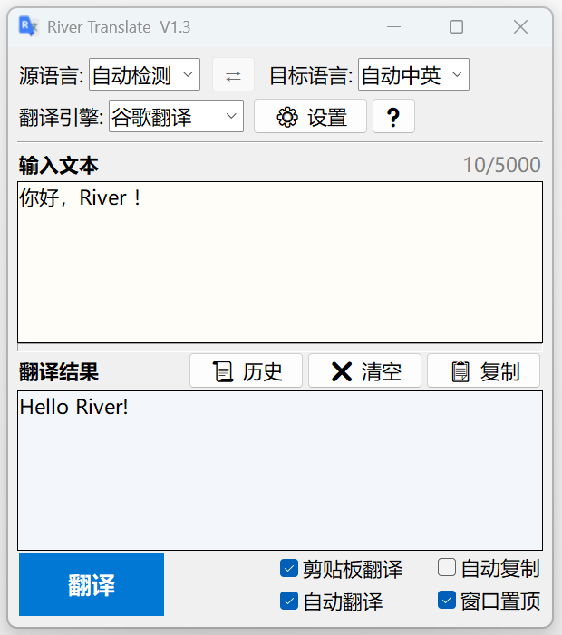
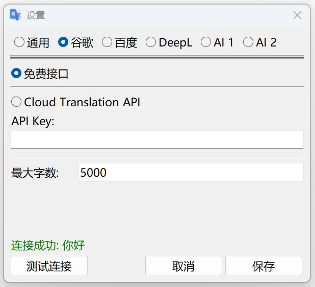
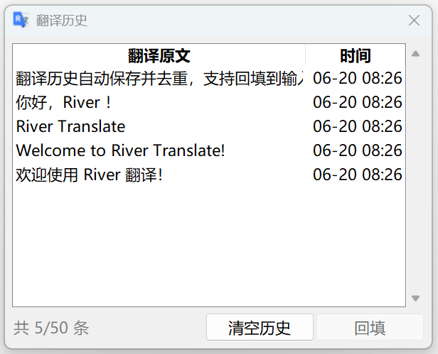

<p align="center">
  
  
  
  
</p>

<h1 align="center">River Translate</h1>

<p align="center">
  轻量、简洁、开箱即用的 Windows 纯文本翻译工具。
</p>

<p align="center">
  
</p>

## 简介

River Translate 是一个基于 Python 标准库和 tkinter 的桌面翻译工具，面向日常查词、短句翻译、剪贴板翻译和多引擎切换。项目运行时不依赖第三方 Python 包，下载源码后即可直接运行。

它适合这些场景：

- 临时翻译一段文本，不想打开浏览器或大型客户端。
- 使用谷歌、百度、DeepL、自定义 AI 等多个翻译服务。
- 复制文本后自动填入并翻译。
- 自动保存翻译历史，之后快速回填。
- 打包成单独的 Windows 桌面程序使用。

## 界面预览

<p align="center">
  
</p>

<p align="center">
  
  &nbsp;&nbsp;
  
</p>

## 功能特性

- **多翻译引擎**：支持谷歌翻译、百度翻译、DeepL、自定义 AI 1、自定义 AI 2。
- **开箱即用**：谷歌免费接口无需配置即可尝试使用。
- **自动语言处理**：源语言支持自动检测，目标语言支持自动中英。
- **自动翻译**：停止输入约 1 秒后自动翻译。
- **剪贴板翻译**：检测到新的剪贴板文本后自动填入并翻译。
- **自动复制**：翻译完成后可自动复制结果。
- **历史记录**：自动保存并去重，可从历史窗口回填原文。
- **窗口置顶**：主窗口可保持在其他窗口上方。
- **轻量实现**：源码运行仅使用 Python 标准库。

## 快速开始

### 方式一：下载 EXE 使用（推荐）

普通用户可以直接在项目发布页（Releases）下载已经打包好的 EXE 或压缩包，无需安装 Python，也无需执行 `pip install`。

建议将程序放在一个独立文件夹中，例如：

```text
River Translate\
└── River Translate.exe
```

首次运行后，程序会在 EXE 同级目录自动创建：

```text
River Translate\
├── River Translate.exe
└── user_data\
    ├── config.json
    └── history.json
```

推荐在桌面创建 `River Translate.exe` 的快捷方式，通过快捷方式启动程序。不要直接把 EXE 和后续生成的 `user_data` 随意分开放置。

`user_data` 保存配置、API Key 和翻译历史，请不要误删，也不要分享给别人。

### 方式二：源码运行

源码运行需要：

- Windows
- Python 3.8 或更高版本

源码运行不需要安装第三方 Python 包。

双击运行：

```bat
run.bat
```

`run.bat` 使用 `pythonw` 启动程序，不会显示控制台窗口。

也可以在命令行运行：

```bat
python src\main.py
```

源码方式首次运行会在项目根目录自动创建：

```text
user_data\
├── config.json
└── history.json
```
## 使用说明

启动后选择源语言、目标语言和翻译引擎，在输入框中输入文本，然后按 `Enter` 或点击“翻译”。

| 操作 | 说明 |
| --- | --- |
| `Enter` | 执行翻译 |
| `Ctrl + Enter` / `Shift + Enter` | 在输入框中换行 |
| `Escape` | 空闲时清空输入和输出 |
| 翻译中按 `Escape` | 终止当前翻译 |
| `⇄` 按钮 | 交换源语言和目标语言，并交换输入/输出文本 |

支持语言：自动检测、中文、英语、日语、韩语、法语、德语、俄语、西班牙语。

目标语言中的“自动中英”会根据输入文本的首个有效字符自动选择中文或英语。

## 翻译引擎

| 引擎 | 接口 | 是否需要配置 | 说明 |
| --- | --- | --- | --- |
| 谷歌翻译 | 免费接口 / Cloud Translation API | 免费接口不需要；Cloud 需要 API Key | 默认引擎。免费接口受网络环境影响较大。 |
| 百度翻译 | 通用翻译 API | 需要 AppID 和 SecretKey | 国内网络通常较稳定。 |
| DeepL | Free API / Pro API | 需要 API Key | 翻译质量较高，按 DeepL 账号类型选择接口。 |
| 自定义 AI 1 / 2 | OpenAI 兼容接口 | Base URL 和 Model 必填，API Key 视服务而定 | 可接入 DeepSeek、MiMo、本地兼容服务等。 |

自定义 AI 的 Base URL 支持以下形式：

```text
https://example.com
https://example.com/v1
https://example.com/v1/chat/completions
```

程序会自动补齐到 Chat Completions 接口。设置中的“领域/风格”会加入系统提示词，用于控制专业术语和表达风格。

## 配置说明

设置窗口中的通用设置和所有翻译引擎配置都会保存到 `user_data/config.json`。你也可以直接编辑这个文件来手动配置，包括当前引擎、语言、自动功能、请求超时、历史条数、各引擎 API Key、接口模式、自定义 AI 名称、Base URL、模型名、领域/风格和最大字数限制。

手动修改 `user_data/config.json` 前请先关闭程序，保存后重新启动生效。

常用通用配置：

| 配置项 | 默认值 | 范围 | 说明 |
| --- | --- | --- | --- |
| `request_timeout_seconds` | `30` | 大于 0 | 翻译请求超时时间，单位秒。 |
| `clipboard_poll_ms` | `500` | `100` 到 `5000` | 剪贴板检测间隔，越小响应越快。 |
| `history_max_items` | `50` | `1` 到 `200` | 翻译历史保存条数上限。 |

每个引擎都有独立的最大字数限制，默认 `5000`，范围为 `100` 到 `100000`。输入接近上限时，主界面的字数计数器会变色提示。

恢复默认配置的方法：关闭程序后删除 `user_data/config.json`，再次启动会自动重新生成。

## 打包为 EXE

项目提供 `build.bat`，用于通过 PyInstaller 打包 Windows 可执行程序。

```bat
build.bat
```

默认打包模式是 `onedir`。也可以显式指定模式：

```bat
build.bat onedir
build.bat onefile
```

打包脚本会：

- 检查 `assets\app.ico` 和 `src\main.py` 是否存在。
- 复用或创建 `.venv`。
- 在 `.venv` 中检查或安装 PyInstaller。
- 删除旧的 `build\` 和 `dist\`。
- 生成新的打包结果。

默认 `onedir` 输出结构：

```text
dist\River Translate\
├── River Translate.exe
└── _internal\
```

`onefile` 输出结构：

```text
dist\River Translate\
└── River Translate.exe
```

打包后的程序首次启动后会在 EXE 同级目录创建：

```text
dist\River Translate\user_data\
├── config.json
└── history.json
```

注意：当前构建脚本每次打包前都会删除整个 `dist\`，因此旧的打包结果以及 `dist\River Translate\user_data` 中的配置和历史都会被清除。源码根目录下的 `user_data\` 不会被打包脚本删除。

## 项目结构

```text
River Translate\
├── assets\
│   └── app.ico              # 应用和 EXE 图标
├── docs\
│   └── images\              # README 演示图片
├── src\
│   ├── config.py            # 默认配置、配置读写、历史管理
│   ├── translator.py        # 翻译引擎实现
│   └── main.py              # tkinter 界面和交互逻辑
├── user_data\               # 本地运行数据，首次运行自动生成
├── build.bat                # PyInstaller 打包脚本
├── run.bat                  # 无控制台启动脚本
├── README.md
└── LICENSE
```

`build\`、`dist\`、`.venv\`、`user_data\` 属于本地生成内容，不应提交到仓库。

## 常见问题

<details>
<summary>user_data 是什么，可以删除或分享吗</summary>

`user_data` 保存本地配置和翻译历史，可能包含 API Key、接口地址、模型名和翻译文本。请不要误删，也不要分享给别人。

删除 `config.json` 会让程序下次启动时重新生成默认配置；删除 `history.json` 会清空翻译历史。
</details>

<details>
<summary>翻译内容会发送到哪里</summary>

翻译时，输入文本会发送到当前选择的翻译服务。不同引擎对应不同服务提供方，请根据文本敏感程度选择合适的引擎。
</details>
<details>
<summary>双击 run.bat 没反应</summary>

通常是 Python 未安装、未加入 PATH，或系统无法找到 `pythonw`。可以在命令行运行 `python --version` 检查 Python 是否可用。
</details>

<details>
<summary>谷歌免费接口不可用</summary>

谷歌免费接口不是正式付费 API，可能受网络环境、服务状态或访问限制影响。可以稍后重试，或切换到百度、DeepL、自定义 AI 等其他引擎。
</details>

<details>
<summary>百度、DeepL、自定义 AI 为什么不能直接用</summary>

这些服务需要对应平台的账号、API Key 或接口地址。请在设置窗口中填写并保存后再使用。
</details>

<details>
<summary>重新打包后配置和历史为什么没了</summary>

`build.bat` 会在打包前删除整个 `dist\`。如果你运行的是打包后的程序，配置和历史位于 `dist\River Translate\user_data\`，因此会一起被删除。源码运行生成的根目录 `user_data\` 不受影响。
</details>

<details>
<summary>打包需要安装依赖吗</summary>

源码运行不需要第三方依赖。打包需要 PyInstaller，`build.bat` 会在 `.venv` 中自动检查并安装。首次安装需要能访问 Python 包索引。
</details>

## 许可

本项目使用 [MIT License](LICENSE)。
